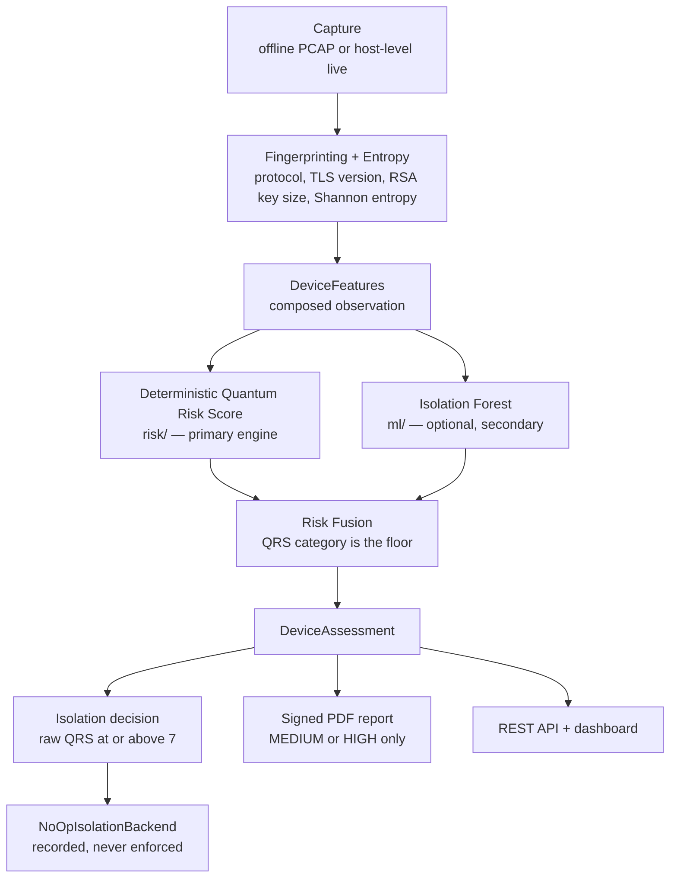

# CIPHER

**CIPHER: An Autonomous Post-Quantum Cryptographic Vulnerability Detection System**

CIPHER is a final-year research prototype that inspects observed network traffic
for cryptographic configurations likely to be weak under post-quantum threat
assumptions. It assigns each observation a deterministic, explainable **Quantum
Risk Score (QRS)**, optionally augments that assessment with a secondary
Isolation Forest anomaly signal, generates ML-DSA-44-signed PDF remediation
reports, and records controlled isolation-eligibility decisions.

It is an academic prototype, not a production security appliance. Enforcement is
currently decision-only: no network state is ever modified.

---

## 1. Overview

Encrypted traffic captured today can be retained and decrypted later, once a
sufficiently capable quantum computer exists. Under that "store now, decrypt
later" assumption, the practical question for an operator migrating toward
post-quantum security is not whether traffic is encrypted, but *which observed
devices and protocol configurations are cryptographically weak enough to matter*
— deprecated TLS versions, undersized RSA keys, missing forward secrecy, and
cleartext application protocols.

CIPHER addresses the detection and assessment half of that problem. For each
observed packet it:

1. classifies the application protocol and extracts TLS/RSA evidence from the
   raw bytes,
2. measures payload Shannon entropy,
3. computes a deterministic five-factor Quantum Risk Score (0–10) and maps it to
   a LOW / MEDIUM / HIGH category,
4. optionally applies a secondary Isolation Forest anomaly signal, which may
   raise the reported category by at most one level,
5. decides isolation eligibility from the **raw** QRS, and
6. produces a signed PDF report for any device whose final category is not LOW.

The deterministic scoring path is primary and always available. Machine learning
is secondary, optional, and deliberately prevented from driving enforcement.

---

## 2. Core Capabilities

All of the following are implemented in this repository.

| Capability | Where | Notes |
|---|---|---|
| Offline PCAP ingestion | `capture/offline_source.py` | Deterministic replay; the primary verified mode |
| Host-level live capture | `capture/host_live_source.py`, `run_live_demo.py` | Windows/Npcap, one host interface, bounded by timeout and packet limit |
| Protocol fingerprinting | `fingerprint/protocol.py` | HTTPS / HTTP / MQTT / TELNET / OTHER, from payload bytes only — never port numbers |
| TLS version detection | `fingerprint/tls.py` | Parses ClientHello/ServerHello, including the TLS 1.3 `supported_versions` extension |
| RSA key-size extraction | `fingerprint/tls.py` | Parses a real X.509 certificate from a TLS Certificate message |
| Forward-secrecy field | `fingerprint/protocol.py` | Reported conservatively as unconfirmed (see limitations) |
| Shannon entropy | `entropy/engine.py` | Bits per byte over the payload |
| Protocol/port exposure risk | `risk/port_risk.py` | Keyed on the classified protocol enum |
| Deterministic Quantum Risk Score | `risk/scoring.py`, `risk/engine.py` | Five additive factors, capped at 10 |
| NIST remediation mapping | `risk/nist_mapping.py` | Findings and reference text per contributing factor |
| Isolation Forest anomaly detection | `ml/` | Secondary, optional, synthetically trained |
| Category fusion | `fusion/risk_fusion.py` | One-level escalation only; QRS category is the floor |
| Isolation-eligibility decision | `enforcement/decision.py` | `raw QRS >= 7`, never the fused category |
| Signed PDF reports | `reports/pdf_generator.py` | Three pages, SHA-256 content hash, ML-DSA-44 signature |
| Post-quantum signing | `signing/` | ML-DSA-44 (CRYSTALS-Dilithium family, FIPS 204) via `dilithium-py` |
| REST API and dashboard | `dashboard/`, `web/` | Flask API plus a compiled React build, one process, one origin |
| Controlled evaluation tooling | `evaluate_demo.py`, `evaluate_research.py`, `evaluation/` | Scenario harness, QRS conformance, Isolation Forest evaluation |
| Performance benchmarking | `evaluate_performance.py`, `evaluation/benchmark.py` | Latency, throughput, process CPU, memory, startup, report generation |
| Preflight environment check | `preflight.py` | Seven runtime preconditions |

**Enforcement is decision-only.** The only backend implemented is
`NoOpIsolationBackend`, which records the decision and returns
`IsolationOutcome(requested=True, enforced=False)`. A HIGH-risk device is
flagged, reported and logged; it is **not** physically blocked. No `iptables`,
Windows Firewall or other network-state integration exists.

---

## 3. System Architecture



**Layer roles.**

- **`capture/`** turns a packet source into `RawPacket` objects. Offline PCAP is
  the primary mode; `capture/live_source.py` remains a documented scaffold that
  raises immediately, while `capture/host_live_source.py` is the separate
  Windows host-level implementation used only by `run_live_demo.py`.
- **`fingerprint/` and `entropy/`** derive evidence from payload bytes alone, with
  no port-number reasoning and no cross-packet correlation.
- **`risk/`** is the deterministic scoring engine: pure functions, no I/O, no
  randomness, no ML.
- **`ml/`** wraps `sklearn.ensemble.IsolationForest` behind `AnomalyDetector`. It
  consumes the same raw observations as `risk/` and never reads a QRS value, so
  no risk-score leakage into features is possible.
- **`fusion/`** combines the two outputs under a frozen category-floor rule.
- **`enforcement/`** decides eligibility from the raw score and delegates to an
  injected backend.
- **`pipeline/`** sequences all of the above once per packet
  (`assessment_pipeline.assess_packet`) and across a capture
  (`runner.run_capture`).
- **`signing/` and `reports/`** produce and verify signed PDF reports.
- **`dashboard/`** serves the REST API and the compiled SPA.
- **`evaluation/`** holds measurement primitives only, and is never imported by
  the runtime.

---

## 4. Quantum Risk Score

The QRS is the primary, deterministic, explainable risk engine
(`risk/scoring.py`). It is the sum of five independent factors, capped at 10:

```
QRS = min(
    TLS_version_risk
  + key_size_risk
  + forward_secrecy_risk
  + entropy_risk
  + port_risk,
    10
)
```

**TLS version risk** — `tls_version_risk()`

| Observed version | Risk |
|---|---|
| TLS 1.0 | 4 |
| TLS 1.1 | 3 |
| TLS 1.2 | 1 |
| TLS 1.3 | 0 |
| Not detected in this packet | 2 |

**RSA key-size risk** — `key_size_risk()`

| Key size | Risk |
|---|---|
| < 1024 bits | 4 |
| 1024 – 2047 bits | 3 |
| 2048 – 3071 bits | 2 |
| ≥ 3072 bits | 0 |
| Not observed | 0 |

Unobserved key size contributes 0 deliberately: a TLS 1.3 certificate is
encrypted and invisible to passive capture, so penalising absence would punish
the strongest protocol version for a visibility limit.

**Forward-secrecy risk** — 1 when forward secrecy is not confirmed, 0 when it is.

**Entropy risk** — `entropy_risk()`

| Payload entropy (bits/byte) | Risk |
|---|---|
| < 6.0 | 2 |
| 6.0 – 6.999… | 1 |
| ≥ 7.0 | 0 |

**Protocol/port exposure risk** — `port_risk_for_protocol()`

| Protocol | Risk |
|---|---|
| HTTPS, OTHER | 0 |
| HTTP, MQTT | 1 |
| TELNET | 2 |

**Category boundaries** — `category_for_score()`

| Score | Category |
|---|---|
| 0 – 2 | LOW |
| 3 – 6 | MEDIUM |
| 7 – 10 | HIGH |

**Isolation eligibility is `raw QRS >= 7`** (`enforcement/decision.py`, threshold
from `config/constants.py`). It reads `risk_assessment.risk_score` and
deliberately never reads `final_category`, so a device escalated to HIGH by the
anomaly signal alone is **not** isolation-eligible.

That decision is the *only* thing that can cause a firewall change. On Linux,
`run_pi_live.py --enforcement iptables` carries an eligible device's isolation
out for real: idempotent DROP rules for that one IPv4 address inside the
CIPHER-owned `CIPHER_ISOLATION` chain, jumped from `FORWARD` only. CIPHER never
flushes a chain, never alters a default policy, and never removes a rule it did
not add; it refuses to isolate loopback, non-IPv4 or the host's own addresses;
and `restore()` removes only that device's own rules. Enforcement requires an
authorized Linux enforcement point on the device's traffic path — a passive
monitor interface observes traffic rather than forwarding it, so there the rule
is installed and drops nothing. It is never enabled implicitly, and Windows
always uses the non-enforcing NoOp backend. See docs/SDD.md §38.

---

## 5. Isolation Forest

Isolation Forest is a **secondary** anomaly signal, never a replacement for the
QRS. Configuration, as implemented in `ml/classifier.py` and `ml/dataset.py`:

| Setting | Value |
|---|---|
| Estimator | `sklearn.ensemble.IsolationForest` |
| `contamination` | 0.05 |
| `random_state` | 42 |
| `n_estimators` | 100 (scikit-learn default) |
| Feature vector | 12 columns, fixed order in `ml.features.FEATURE_NAMES` |
| Training matrix | 190 × 12, **synthetic** (`ml/dataset.py`) |

The twelve features are payload entropy, payload length, TLS version value and
an observed-indicator, RSA key size and an observed-indicator, forward secrecy,
and a five-column one-hot protocol encoding. No QRS value or component is ever
used as a feature.

**Score semantics.** `decision_function()` is negated so that
`anomaly_score` is high when an observation looks more anomalous, and
`is_anomaly` is exactly `raw_decision < 0`. `AnomalyAssessment.confidence` is a
sigmoid of the anomaly score scaled by a training-time standard deviation. **It
is not a calibrated probability**, Isolation Forest is not a probabilistic
estimator, and no calibration metric is computed anywhere in this project.

**Fusion rule** (`fusion/risk_fusion.py`), frozen: the QRS category is the floor,
and a flagged anomaly raises it by exactly one level.

```
LOW    + anomaly -> MEDIUM
MEDIUM + anomaly -> HIGH
HIGH   + anomaly -> HIGH
```

`confidence` never influences fusion; only the boolean `is_anomaly` does.

**Graceful degradation.** No trained artifact is committed
(`ml/artifacts/*.joblib` is gitignored). If the artifact is missing,
`ml/loading.py` logs one warning and returns `None`, fusion passes the QRS
category through unchanged, and CIPHER runs in **QRS-only mode** with scoring
entirely unaffected. A corrupt artifact is a genuine error and is never silently
treated as absent.

**Measured limitation.** The controlled evaluation found that the synthetic
training distribution differs substantially from the feature vectors the real
pipeline produces, and that adding the current model **degraded** every affected
controlled classification metric. See [Evaluation](#13-evaluation). This is a
documented research finding, not a resolved issue.

---

## 6. Capture Modes

### A. Offline / controlled PCAP processing

The primary and most thoroughly verified mode. `CAPTURE_MODE=offline` (the
default) replays a `.pcap` file deterministically through the full pipeline. All
controlled evaluation and benchmarking uses this path.

### B. Windows host-level live capture

`run_live_demo.py` captures from one selected host interface via Npcap and
scapy, with `promisc=False`, bounded by a timeout and a packet limit.

This observes **traffic visible to the selected host interface** — this
machine's own traffic. Because the pipeline identifies a device by
`RawPacket.src_ip`, and a host interface is a single monitored endpoint rather
than a network of peers, this capture source orients every packet around the
interface's own local IPv4 address so the local host is consistently the
reported device. That normalisation applies only to this source and never to
offline PCAP processing.

It is **not** Raspberry Pi monitor-mode capture, not a Wi-Fi network tap, and not
promiscuous visibility into other clients.

### C. Raspberry Pi / external Wi-Fi adapter deployment

The intended deployment target is a Raspberry Pi 4 Model B with a single
external USB Wi-Fi adapter in monitor mode. The current state must be read
precisely, because two different things are easy to conflate:

| Statement | Status |
|---|---|
| **Hardware monitor-mode capability verified** — AR9271 adapter recognised, `ath9k_htc` driver loaded, monitor mode enabled, Radiotap/802.11 frames captured with `tcpdump`, PCAP file written | Verified on the bench by the project team |
| **Complete end-to-end CIPHER monitor-mode pipeline validated** | **Not yet.** No Radiotap/802.11 capture source exists in `capture/`, so monitor-mode frames are not yet ingested by CIPHER itself |

The bench verification establishes that the chosen adapter and driver can
produce monitor-mode captures on the Pi. It does **not** establish that CIPHER
parses 802.11/Radiotap frames: the existing fingerprinting path consumes
TCP/UDP payloads, and a monitor-mode ingestion path remains to be implemented.
The hardware manual records monitor-mode capture as software-pending for the
same reason.

A PCAP captured on the Pi can, however, be processed today through the offline
mode, since that path is frame-format independent at the point it receives
payload bytes.

---

## 7. Hardware

From the project bill of materials
([`docs/hardware_manual/CIPHER_Raspberry_Pi_Hardware_Assembly_Manual.md`](docs/hardware_manual/CIPHER_Raspberry_Pi_Hardware_Assembly_Manual.md)):

| Qty | Item | Role | Status |
|---|---|---|---|
| 1 | Raspberry Pi 4 Model B, 4 GB | Host platform | In use |
| 1 | microSD card | Raspberry Pi OS 64-bit | In use |
| 1 | Pi 4 USB-C power supply | Adequately rated | In use |
| **1 (exactly one)** | Qualcomm Atheros AR9271 USB Wi-Fi adapter | Monitor-mode capture (`ath9k_htc`) | Hardware capability verified |
| 1 | SSD1306 I²C OLED | Status display | Hardware pending — no driver code |
| 3 | Green / amber / red LEDs | LOW / MEDIUM / HIGH indicators | Hardware pending — no driver code |
| 3+ | Current-limiting resistors | One per LED | Hardware pending |
| as needed | Male-to-female jumper wires | Breadboard ↔ GPIO header | Hardware pending |

**One external adapter only.** The project budget covers exactly one external
USB Wi-Fi adapter. The Pi's built-in Wi-Fi handles management and network
connectivity and is never repurposed for capture, while the external AR9271
interface is used for monitor-mode work. Interface names are deployment-specific
and should be read from `ip link` / `iw dev` rather than assumed.

**No GPIO or OLED code exists in this repository.** The OLED and LEDs are in the
approved bill of materials, but no driver, pin map or `hardware/` package is
implemented, and the hardware manual deliberately leaves the pin assignments
pending rather than guessing them.

---

## 8. Repository Structure

```
cipher/
├── capture/            # Packet sources: offline PCAP, live scaffold, host-level live
├── entropy/            # Shannon entropy
├── fingerprint/        # Protocol classification, TLS/RSA parsing
├── risk/               # Deterministic Quantum Risk Score + NIST mapping
├── ml/                 # Isolation Forest: features, dataset, classifier, loading, train
├── fusion/             # QRS + anomaly category fusion
├── enforcement/        # Isolation-eligibility decision + NoOp backend
├── signing/            # ML-DSA-44 signing, verification, key store
├── reports/            # Signed 3-page PDF generation
├── pipeline/           # Per-packet assessment and capture-run orchestration
├── dashboard/          # Flask REST API + SPA serving
├── evaluation/         # Measurement primitives: metrics, benchmark (runtime never imports this)
├── models/             # Domain dataclasses
├── config/             # Settings and constants
├── utils/              # Logging, exceptions
├── web/                # Compiled React production build
├── tests/              # Test suite and controlled fixtures
├── docs/               # SDD.md, DEMO_GUIDE.md, hardware_manual/
├── main.py                  # Offline batch run, then exit
├── run_demo.py              # Integrated dashboard + API (presentation entry point)
├── run_api.py               # API-only development server
├── run_live_demo.py         # Host-level live capture demo (CLI)
├── preflight.py             # Pre-start environment check
├── launch_cipher.py         # Launcher used by Start CIPHER.bat
├── evaluate_demo.py         # Five-scenario controlled evaluation harness
├── evaluate_research.py     # QRS conformance + Isolation Forest evaluation
├── evaluate_performance.py  # Controlled offline performance benchmark (CLI)
├── measure_startup.py       # Startup-time measurement
├── requirements.txt
└── Start CIPHER.bat         # Windows double-click launcher
```

---

## 9. Installation

Python 3.12 is the verified development baseline. Dependencies are pinned in
[`requirements.txt`](requirements.txt): Flask, Scapy, scikit-learn, joblib,
dilithium-py, cryptography, reportlab, python-dotenv, pytest and numpy.

**Windows**

```powershell
python -m venv venv
.\venv\Scripts\Activate.ps1
python -m pip install --upgrade pip
pip install -r requirements.txt
```

**Linux / Raspberry Pi**

```bash
python3 -m venv .venv
source .venv/bin/activate
python3 -m pip install --upgrade pip
pip install -r requirements.txt
```

Build a fresh environment from `requirements.txt` on the Pi rather than copying
a Windows virtual environment. ARM64 wheel availability for the pinned versions
is resolved during Pi bring-up.

**System packages.** Nothing in the offline path needs a system package beyond
Python. Host-level live capture on Windows requires **Npcap**, since scapy
depends on it for interface capture. Monitor-mode work on the Pi uses standard
Linux tooling (`iw`, `ip`, `tcpdump`) and the in-kernel `ath9k_htc` driver.

---

## 10. Preflight

```bash
python preflight.py
```

Runs seven checks and prints `PASS` / `WARN` / `FAIL` per check: Python runtime,
required imports, the compiled web build, the demo fixture, the Isolation Forest
artifact, signing keys, and availability of the dashboard port. It never starts
the application, regenerates a fixture, trains a model or overwrites a key.

A missing Isolation Forest artifact is reported as a **warning, not a failure**:
CIPHER then runs in QRS-only mode, and deterministic scoring is unaffected.

---

## 11. Isolation Forest Training

```bash
python -m ml.train
```

Fits an `AnomalyDetector` on the synthetic 190 × 12 matrix from `ml/dataset.py`
with the frozen configuration (`contamination=0.05`, `random_state=42`) and
saves it to:

```
ml/artifacts/anomaly_detector.joblib
```

That artifact is **gitignored and not committed**, so it must be produced
locally, and should be regenerated under the Python and scikit-learn versions of
whichever machine will run it.

**The training data are synthetic.** They are not derived from, and make no
claim to represent, real hospital, campus, enterprise or IoT traffic. They exist
to make the fit reproducible. The controlled evaluation in
`evaluate_research.py` deliberately fits its own model in memory rather than
reading this artifact, so its figures do not depend on which machine produced it.

---

## 12. Running CIPHER

`main.py`, `run_demo.py`, `run_api.py` and `evaluate_demo.py` take no
command-line flags; they are configured by environment variables read in
`config/settings.py` (`CAPTURE_MODE`, `PCAP_PATH`, `MODEL_PATH`, `FLASK_HOST`,
`FLASK_PORT`, `LOG_LEVEL` and others).

| Command | Behaviour |
|---|---|
| `python run_demo.py` | Integrated application: React dashboard and REST API from one Flask process on one origin. Dashboard at `http://127.0.0.1:5000`. |
| `python main.py` | One offline capture pass, then exits. No server. |
| `python run_api.py` | API-only development server, no web UI. |
| `Start CIPHER.bat` | Windows launcher: selects a project virtual environment, runs preflight, starts `run_demo.py`, waits for a real `HTTP 200` from `/api/health`, then opens the browser. |

**Host-level live capture.**

```bash
python run_live_demo.py --list-interfaces
```

Prints index, name, description and IPv4 for each available interface, then
exits.

```bash
python run_live_demo.py --interface "<interface name>" --timeout 30
```

Captures from that interface and serves the dashboard on port 5010 by default.
Additional flags: `--packet-limit` (default 500), `--port` (default 5010), and
`--timeout` (default 30 seconds). The interface may also be supplied via the
`LIVE_CAPTURE_INTERFACE` environment variable. The console prints a disclaimer
stating that this is host-level capture and not Raspberry Pi monitor-mode
capture.

**REST API**

| Method and path | Description |
|---|---|
| `GET /api/health` | Service status and summary counts |
| `GET /api/devices` | Assessed devices |
| `GET /api/devices/<ip>` | Full detail for one device |
| `GET /api/devices/<ip>/report` | Report metadata for one device |
| `GET /api/devices/<ip>/report/download` | The signed PDF report |

---

## 13. Evaluation

Three evaluation entry points, reporting separate things that must not be
conflated. All results below are **controlled evaluations on deterministic
synthetic/offline observations** this project constructed for itself. None is a
measurement of real-world deployment accuracy.

```bash
python evaluate_demo.py        # five-scenario controlled harness
python evaluate_research.py    # QRS conformance + Isolation Forest evaluation
```

`evaluate_research.py` writes JSON and CSV to `data/evaluation/research/`.

### A. Deterministic QRS specification conformance

Thirty deterministic labelled observations run through the real pipeline, with
expected scores derived from the published formula beforehand.

| Measure | Result |
|---|---|
| Exact score matches | 30 / 30 |
| Mean absolute error | 0.0 |
| Per-component agreement (all five factors) | 30 / 30 |
| Category agreement | 30 / 30 |
| Isolation-threshold agreement | 30 / 30 |

This measures **implementation conformance to a frozen specification**. It is
not detection accuracy, and because the scenarios and the formula share
NIST-derived criteria, it is not evidence of external validity either.

### B. Controlled security classification (QRS-only, N = 24)

Labels come from an a-priori external rubric — RFC 8996, RFC 8446, NIST SP
800-52r2 and SP 800-131A Rev. 2 — fixed before execution and never derived from
CIPHER's output. Six of the thirty observations carry no clean standards-based
binary label and are excluded from the confusion matrices.

| Metric | Remediation flagging (`category != LOW`) | Isolation eligibility (`raw QRS >= 7`) |
|---|---|---|
| Accuracy | 87.50% | 70.83% |
| Precision | 81.25% | 100.00% |
| Recall | 100.00% | 46.15% |
| Specificity | 72.73% | 100.00% |
| F1 | 89.66% | 63.16% |
| False-positive rate | 27.27% | 0.00% |

The two operating points trade off in opposite directions, by design.
Remediation flagging misses nothing externally risky but carries a 27.27%
controlled false-positive rate, driven by three realistically-shaped secure TLS
1.3 observations whose short or zero-padded handshake payloads attract an
entropy penalty. Isolation eligibility is conservative: it never flags an
externally safe observation, at the cost of missing cleartext HTTP, unencrypted
MQTT and TLS 1.1, which all score 6 and so fall below the threshold of 7.

### C. Isolation Forest evaluation

Measured on the same thirty observations, using the feature vectors the real
inference path builds.

| Metric | Synthetic held-out set (N = 190) | Pipeline-extracted (N = 24) |
|---|---|---|
| Accuracy | 100.00% | 58.33% |
| Precision | 100.00% | 56.52% |
| Recall | 100.00% | 100.00% |
| Specificity | 100.00% | 9.09% |
| F1 | 100.00% | 72.22% |
| False-positive rate | 0.00% | 90.91% |
| ROC-AUC | 1.0000 | 0.9371 |

**The ROC-AUC and the specificity must be read together.** An AUC of 0.9371 says
the continuous anomaly score *ranks* externally-risky observations above safe
ones reasonably well. It does **not** say the model classifies them correctly:
at the threshold the model actually uses, specificity is 9.09% and the
controlled false-positive rate is 90.91%. Quoting 0.9371 on its own would
misrepresent the result. The AUC is also computed over only 24 observations with
a 13/11 split, so its confidence interval is wide, and the risky cohort
correlates with low entropy and short payloads — properties the model partly
keys on — so the ranking ability is not fully independent of how the labels were
defined.

The underlying cause is a **train/serve feature distribution mismatch**. Every
training row carries both a TLS version and an RSA key size, which no single
real packet can; `key_size_observed` is 0 for 100% of pipeline-safe vectors and
0% of training rows. Forward secrecy is 0 for every real vector but set in 83%
of training-normal rows. Real handshake records are also shorter and
lower-entropy than the synthetic normals.

### D. Fusion effect, paired on identical observations

| Metric | QRS-only | QRS + current Isolation Forest |
|---|---|---|
| Accuracy | 87.50% | 58.33% |
| Precision | 81.25% | 56.52% |
| Recall | 100.00% | 100.00% |
| Specificity | 72.73% | 9.09% |
| False-positive rate | 27.27% | 90.91% |

**The current Isolation Forest does not improve CIPHER's controlled
classification.** Six metrics worsen, none improves, recall was already
saturated, and ten externally safe observations were escalated. This is reported
as a research limitation rather than omitted.

Physical isolation eligibility was verified **identical** with and without the
model, confirming that an ML-only escalation cannot trigger an enforcement
action.

---

## 14. Performance

**Windows controlled offline benchmark**, measured on the development machine
with `evaluate_performance.py` over 30 deterministic offline packets read from
disk before timing began. Latency uses `time.perf_counter_ns()` with warm-up and
900 samples per benchmark.

```bash
python evaluate_performance.py
python evaluate_performance.py --skip-startup --latency-reps 50
python evaluate_performance.py --stability-iterations 500
```

| Benchmark | Mean |
|---|---|
| QRS-only assessment latency | 0.0432 ms |
| QRS + Isolation Forest assessment latency | 4.9397 ms |
| Incremental ML overhead (paired per observation) | 4.8965 ms |
| Full per-packet pipeline, QRS-only | 0.0476 ms |
| Full per-packet pipeline, with model | 5.0185 ms |
| Startup (subprocess, cold) | 3.352 s |
| Signed PDF report generation | 53.81 ms |

**Single-threaded controlled offline throughput**: 21,604.6 assessments/s
QRS-only, and 204.9 assessments/s with the model attached. This counts
sequential in-process assessments of already-loaded packets per wall-clock
second. It is **not** network throughput, packet-capture throughput, or line
rate.

Process CPU utilisation was 0.983 QRS-only and 0.987 with the model, where 1.0
is approximately one logical core fully busy **by this process**. This is not
whole-system CPU usage. Peak RSS is unavailable on Windows from the standard
library and is reported as not available rather than estimated; the Python heap
peak was 0.132 MiB via `tracemalloc` in a separate pass.

Isolation Forest inference dominates per-packet cost, adding roughly 4.9 ms
against a 0.043 ms deterministic path, and it was slower in 900 of 900 paired
observations.

The software enforcement decision measured 0.0005 ms mean. That is the
`should_isolate()` call plus the NoOp backend only. **It is not physical
isolation latency**, which remains unmeasured: an `iptables` enforcement
backend now exists, but no measurement of it on a real enforcement path has
been taken, and the figure above includes no `iptables` invocation at all.

**Raspberry Pi performance measurements are pending.** They will be collected
with this same benchmark harness, which runs unchanged on ARM64 and records
platform metadata in its JSON output so Windows and Pi runs can be
distinguished. No Pi figures are stated here because none have been measured.

---

## 15. Testing

```bash
pytest -q
```

Current verified baseline: **1192 passed, 0 failed**.

A Scapy deprecation warning about finite-field Diffie-Hellman is emitted by that
third-party library and is not a functional failure.

Focused suites:

```bash
pytest tests/risk/ -v
pytest tests/ml/ -v
pytest tests/pipeline/ -v
pytest tests/evaluation/ -v
pytest tests/reports/ -v
pytest tests/dashboard/ -v
```

No coverage percentage is claimed, because none has been measured.

---

## 16. Security and Research Scope

CIPHER is a research and educational prototype. It is not a production firewall,
a commercial security appliance, a certified IDS/IPS, or a production PKI
scanner.

- **Controlled results are not deployment accuracy.** Every figure in this README
  comes from deterministic synthetic/offline fixtures this project authored.
  None measures performance on real network traffic.
- **The Isolation Forest is synthetically trained**, and the controlled
  evaluation documents a substantial train/serve feature mismatch. Its
  `confidence` value is not a calibrated probability.
- **Enforcement is decision-only.** No network state is modified, and physical
  isolation latency has never been measured.
- **Post-quantum signing protects CIPHER's own reports, not the observed
  traffic.** ML-DSA-44 signatures make a report's integrity and origin verifiable
  against future quantum attack. They do nothing to the legacy TLS sessions
  CIPHER observes, which remain exactly as weak as they were.
- **CIPHER assesses cryptographic weakness; it does not remediate it.** It
  identifies devices and configurations needing attention and produces
  remediation guidance. It cannot convert a legacy device to post-quantum
  cryptography.
- **Signing keys are stored as plain files** with no passphrase encryption or OS
  keyring integration.

References to FIPS 204, RFC 8996, RFC 8446 and NIST SP 800-52r2 / SP 800-131A
describe the standards CIPHER's logic and evaluation rubric refer to. They are
not a certification, endorsement or validation of CIPHER itself.

---

## 17. Current Project Status

| Component | Status |
|---|---|
| Software pipeline (capture → assessment → report) | Implemented |
| Deterministic Quantum Risk Score | Implemented and evaluated |
| Isolation Forest anomaly detection | Implemented and evaluated |
| Risk fusion | Implemented and evaluated |
| Signed PDF reports | Implemented |
| REST API and dashboard | Implemented |
| Offline PCAP processing | Implemented and verified |
| Windows host-level live capture | Implemented and verified |
| Controlled evaluation tooling | Implemented |
| Performance benchmark harness | Implemented; Windows figures collected |
| Raspberry Pi 4 / ARM64 environment | Brought up by the project team; the current 1192-test baseline has not been re-verified on the Pi |
| AR9271 monitor mode | Hardware capability verified on the bench |
| CIPHER monitor-mode (802.11/Radiotap) ingestion | Not implemented |
| Raspberry Pi performance benchmark | Pending execution |
| Linux/Pi live network capture (real source identity preserved) | Implemented (`run_pi_live.py`); not yet exercised on Pi hardware |
| Physical network isolation (`iptables`) | Implemented as an opt-in Linux backend: idempotent DROP rules for one IPv4 device in the CIPHER-owned `CIPHER_ISOLATION` chain, jumped from `FORWARD` only. Requires an authorized Linux enforcement point on the device's traffic path and root/`CAP_NET_ADMIN`. **A passive monitor-mode interface is not an enforcement path** — on a monitor-only topology the rule is installed and drops nothing. Never enabled implicitly; Windows remains NoOp. Not yet exercised on Pi hardware |
| Physical isolation latency | Not measured |
| SSD1306 OLED integration | Not implemented; no driver code, pin map pending |
| GPIO status LED integration | Not implemented; no driver code, pin map pending |
| Sustained long-duration Pi operation | Not validated |

---

## 18. Future Work

The following are **not implemented** and are recorded as intended future work.

- **Deployment-grounded anomaly training** — retraining or redesigning the
  anomaly stage against feature distributions the real pipeline actually
  produces, addressing the measured train/serve mismatch.
- **Larger real-network validation** — evaluation against real captured traffic
  with independently established ground truth, rather than controlled synthetic
  fixtures.
- **Formal Raspberry Pi performance evaluation** — running the existing
  benchmark harness on the Pi, including the sustained-run mode for thermal and
  stability behaviour.
- **Monitor-mode ingestion** — an 802.11/Radiotap capture source so monitor-mode
  frames reach the assessment pipeline directly.
- **Physical enforcement** — a real Linux firewall backend, including the policy
  decisions (chain, direction, `DROP` versus `REJECT`, restoration) that the
  current specification does not define.
- **OLED and GPIO status output** — driver code and a frozen pin map for the
  SSD1306 display and the three status LEDs.
- **Cooperating-device post-quantum secure channel** — extending beyond passive
  assessment toward PQC-protected communication between cooperating devices.
- **Broader protocol coverage** — Zigbee, BLE and other non-IP IoT link layers.
- **Scaling and multi-site monitoring** — concurrent processing and aggregation
  across several monitored sites.

---

## Documentation

- [`docs/SDD.md`](docs/SDD.md) — software design document, with phase-by-phase
  addenda covering every design decision, frozen rule and evaluation phase
- [`docs/DEMO_GUIDE.md`](docs/DEMO_GUIDE.md) — presentation walkthrough and
  troubleshooting
- [`docs/hardware_manual/CIPHER_Raspberry_Pi_Hardware_Assembly_Manual.md`](docs/hardware_manual/CIPHER_Raspberry_Pi_Hardware_Assembly_Manual.md)
  — Raspberry Pi assembly manual, with per-section implementation-status markers

## Project

Final-year major project and research prototype.

Repository: <https://github.com/chandini-narayana/cipher-pqc>
