# CIPHER — Raspberry Pi Hardware Assembly & Deployment Manual

**Cryptographic Intelligence for Post-quantum Hazard Evaluation and Readiness Assessment**

Manual version 1.1 · Generated 28 September 2026 · Consistency-audited 1 October 2026
Source of truth: repository `cipher-pqc`, branch `master`, software v0.1.0-dev

> **Revision 1.1 (consistency audit).** Version 1.0 was written before Raspberry Pi bring-up and
> before the reviewer-evaluation phases were added to the repository. This revision records the
> hardware and bring-up work that has since been completed, corrects the test-baseline figures,
> and sharpens the distinction between *verified monitor-mode hardware capture* and *CIPHER
> end-to-end monitor-mode ingestion*. All physical assembly guidance is unchanged.

> This is the editable Markdown source for the manual. The published deliverable is
> `docs/CIPHER_Raspberry_Pi_Hardware_Assembly_Manual.pdf`, built from `manual.html` in this
> same folder (which uses `assets/style.css` and the vector diagrams in `diagrams/`, generated
> by `assets/gen_diagrams.py`). This file mirrors the same content in plain Markdown for easy
> editing and diffing; it is not itself converted to the PDF.

Target hardware: **Raspberry Pi 4 Model B — 4GB**
Network configuration: **1 × Built-in Wi-Fi (management)**, **1 × External USB Monitor Adapter**

On the deployment used for this revision the built-in Wi-Fi came up as `wlan0` and the single
external Qualcomm Atheros AR9271 adapter as `wlan1`. Those names are **observed, not normative** —
always read the actual names from `ip link` / `iw dev` rather than assuming them.

---

## How to read this manual

This manual follows one rule above all others: **it never invents hardware, GPIO pins, network
architecture, or software behaviour that does not already exist in the CIPHER repository.** Every
page/section below is labelled with one of these status markers, taken from a repository audit
performed before this manual was written:

| Marker | Meaning |
|---|---|
| **CURRENTLY IMPLEMENTED** | Verified, working code exists in the repository today and is covered by the test suite. |
| **HARDWARE CAPABILITY VERIFIED** | The physical hardware has been exercised successfully outside CIPHER (e.g. monitor mode with `tcpdump`), but CIPHER itself does not yet consume it. |
| **HARDWARE INTEGRATION PENDING** | The physical component (OLED, LEDs) is in the approved bill of materials, but no CIPHER driver code exists yet. |
| **SOFTWARE IMPLEMENTATION PENDING** | The capability (monitor-mode ingestion, Linux enforcement, systemd) is architecturally planned but not yet coded. |
| **GPIO ASSIGNMENT PENDING** | No pin numbers are frozen or approved anywhere in the repository. |
| **REFERENCE** | A factual hardware specification (e.g. the Pi's own pin numbering), shown for context only — not a CIPHER decision. |

### Document information

| Field | Value |
|---|---|
| Manual version | 1.1 (consistency-audited 1 October 2026) |
| Generated | 28 September 2026 |
| Source repository state | `cipher-pqc`, branch `master`, software v0.1.0-dev |
| Test baselines | 1192 passing on the Windows development machine (current). 649/649 passing on the Pi at the earlier pre-reviewer-evaluation baseline; the 1192 baseline has **not** yet been pulled and re-verified on the Pi. |
| Primary sources consulted | `README.md`, `docs/SDD.md`, `docs/DEMO_GUIDE.md`, and every listed source module (`capture/`, `enforcement/`, `config/`, `ml/`, `dashboard/`, `reports/`) |
| Key assumption | No GPIO pins, OLED wiring, LED wiring, systemd unit, or Linux firewall policy is approved anywhere in the repository as of this writing — all are marked PENDING rather than guessed. |
| Fixed constraint carried throughout | Exactly one external USB Wi-Fi adapter. Built-in Wi-Fi is always the management interface. |

---

## Repository Audit Summary

Performed directly against the repository before any manual content was written.

| Item | Implemented? | Exact source | Safe to document as final? |
|---|---|---|---|
| Raspberry Pi OS-level bring-up | Yes (completed) | ARM64 Debian 13 on Pi 4 Model B 4GB; repository cloned, `.venv` built, pinned dependencies installed, imports succeeded, `preflight.py` passed, 649/649 tests passed at the then-current baseline | Yes — as bring-up; see "Completed Raspberry Pi Bring-Up" below |
| OLED driver code | No | Not found anywhere (`grep -r ssd1306/oled` — zero matches) | No |
| GPIO LED driver code | No | Not found anywhere; no `hardware/` package exists | No |
| GPIO pin assignments | No | No constant, config, or doc defines a pin number for any peripheral | No — marked PENDING |
| Windows host-level live capture | Yes (tested, Windows-only) | `capture/host_live_source.py` — a separate, temporary `run_live_demo.py` path; normalizes traffic around the local host; covered by `tests/capture/test_host_live_source.py` | Yes — document as its own, distinct capability |
| Raspberry Pi / multi-device live capture | No (scaffold only) | `capture/live_source.py` — raises `LiveCaptureNotImplementedError` immediately; this is the general, Pi-oriented scaffold, unaffected by the Windows path above | No |
| Monitor-mode **hardware** capability | Yes (verified outside CIPHER) | AR9271 on `ath9k_htc` (firmware 1.3) switched to monitor mode; 802.11 + Radiotap frames captured with `tcpdump`; 100-packet PCAP written | Yes — as a hardware capability only |
| Monitor-mode **handling inside CIPHER** | No | Not referenced anywhere in `capture/`; no Radiotap/802.11 parsing exists | No — see "Monitor-Mode Capture vs CIPHER Ingestion" |
| Linux enforcement backend | No | `enforcement/backends.py` — only `NoOpIsolationBackend` exists; module docstring explicitly defers iptables | No — do not apply firewall rules |
| systemd service unit | No | No `.service` file anywhere in the repository | No |
| Dashboard network binding | Configurable, defaults to localhost | `config/constants.py` — `DEFAULT_FLASK_HOST = "127.0.0.1"`, overridable via `FLASK_HOST` env var | Yes — document the existing override |
| ML model loading | Yes | `ml/loading.py`, `ml/train.py` — optional, QRS-only mode if absent | Yes |
| Report generation | Yes | `reports/pdf_generator.py` — ML-DSA-44 signed, 3-page PDF | Yes |
| Core risk pipeline (QRS + fusion + enforcement decision) | Yes | `risk/`, `fusion/`, `enforcement/decision.py` — 1192 tests passing on Windows | Yes |

**What this means for this manual:** pages describing the existing pipeline, reports, dashboard,
and enforcement *decision logic* are written as CURRENTLY IMPLEMENTED. Every page touching
physical Pi hardware (OLED, LEDs, GPIO, monitor-mode capture, Linux firewall rules, systemd) is
written as PENDING and describes the intended architecture only.

---

## System Overview

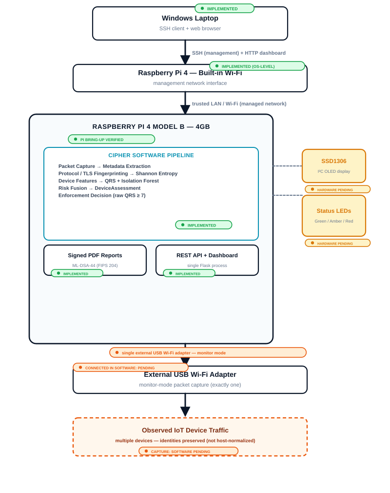

End-to-end view: management path (Windows laptop → SSH/dashboard → Pi built-in Wi-Fi), the
existing CIPHER software core (capture → fingerprint → entropy → QRS + Isolation Forest → fusion
→ enforcement decision → reports/REST/dashboard, all **implemented**), and the monitoring path
(single external USB Wi-Fi adapter → observed IoT traffic). Pi bring-up is now **verified**; the
adapter's monitor mode is **hardware-verified**, while CIPHER's ingestion of monitor-mode traffic
remains **software pending**. The OLED and status LEDs are shown attached to the Pi as **hardware
integration pending**.

---

## Network Architecture

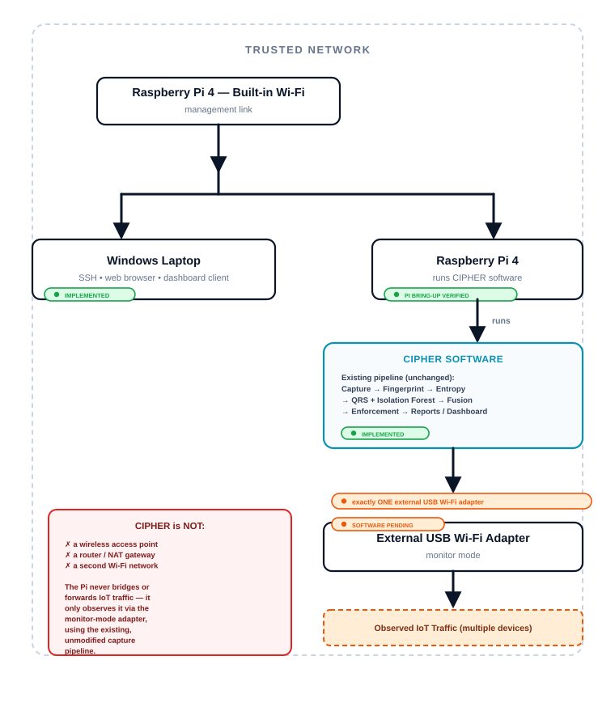

One trusted network. Built-in Wi-Fi carries management traffic (SSH, dashboard); the single
external USB adapter carries monitoring traffic. CIPHER never bridges, routes, or creates a
second wireless network — it is not an access point, router, or NAT gateway.

---

## Bill of Materials

| Qty | Item | Role |
|---|---|---|
| 1 | Raspberry Pi 4 Model B | 4GB RAM |
| 1 | microSD card | Raspberry Pi OS 64-bit |
| 1 | Pi 4 USB-C power supply | official / adequately rated |
| **1 (exactly one)** | External USB Wi-Fi adapter — Qualcomm Atheros **AR9271** (`ath9k_htc`, firmware 1.3) | Linux monitor-mode capable; monitor mode verified on this adapter |
| 1 | SSD1306 I²C OLED | status display (pending) |
| 1 | Green LED | LOW risk indicator (pending) |
| 1 | Amber/Yellow LED | MEDIUM risk indicator (pending) |
| 1 | Red LED | HIGH risk indicator (pending) |
| 3+ | Current-limiting resistors | one per LED, value per datasheet |
| as needed | Male-to-female jumper wires | breadboard ↔ GPIO header |
| 1 (if needed) | Breadboard | only if it eases safe assembly |
| 1 | Windows laptop | SSH, dashboard, flashing microSD |

**Fixed hardware constraint:** this project can afford exactly one external USB Wi-Fi adapter.
The Pi's built-in Wi-Fi always handles management and is never repurposed for capture. Do not
add, list, or budget for a second external adapter.

---

## Component Identification

### Raspberry Pi 4 Board

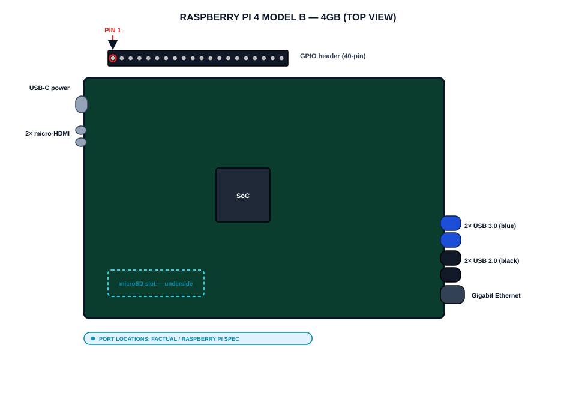

Port and connector locations (USB-C power, 2× micro-HDMI, 2× USB 3.0, 2× USB 2.0, Gigabit
Ethernet, 40-pin GPIO header with Pin 1 marked, microSD slot on the underside) are factual
Raspberry Pi 4 Model B specifications, shown for identification only.

### GPIO Header, Pin 1 & Wi-Fi Roles

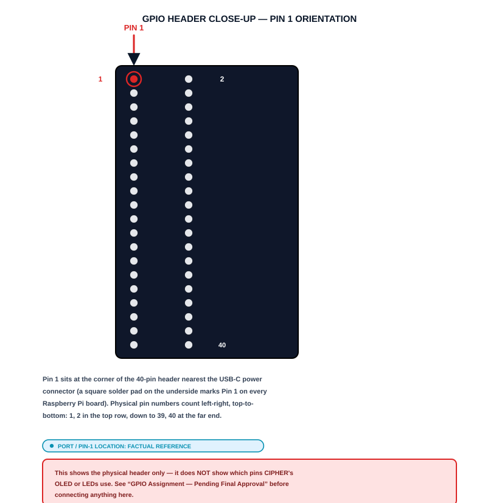
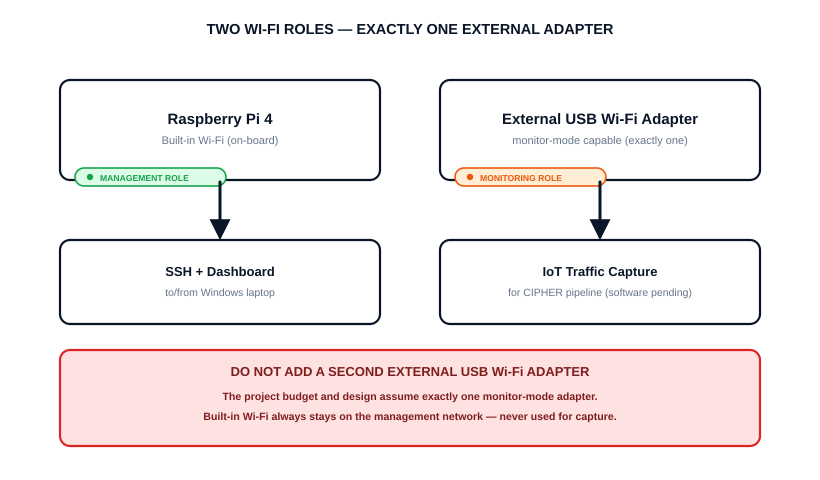

Pin 1 sits at the corner of the 40-pin header nearest the USB-C power connector. Built-in Wi-Fi
= management role; the single external USB adapter = monitoring role.

### OLED, LEDs, Resistors & Wires

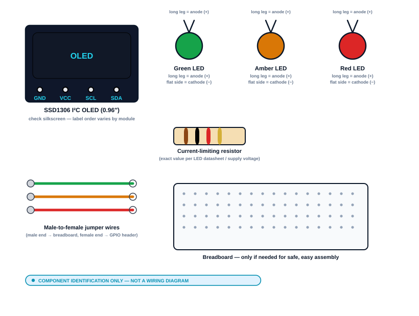

Identification only — none of these are wired yet. See "GPIO Assignment — Pending Final Approval."

---

## Safety Before You Begin

**General handling**
- Power the Pi off (unplug USB-C) before connecting/disconnecting any GPIO wiring.
- Use a suitable, adequately-rated official Raspberry Pi 4 USB-C power supply.
- Take basic static-discharge precautions.
- Do not experimentally move wires while uncertain — stop and re-check the diagram.
- Double-check every connection against its labelled diagram before applying power.

**Electrical specifics**
- Raspberry Pi GPIO logic is **3.3V** — never apply 5V logic directly to a GPIO pin.
- Avoid shorts between adjacent header pins, especially power and GND.
- Never connect an LED directly to a GPIO pin without a current-limiting resistor.
- LED polarity matters: long leg = anode (+), flat side = cathode (−).
- Confirm you are using a GPIO pin, not a power pin (3V3/5V), before connecting a signal wire.

> **Stop if unsure.** GPIO wiring for the OLED and LEDs is currently pending final approval —
> do not improvise pin choices to "get it working" ahead of that approval.

---

## MicroSD Card & OS Setup (Windows)

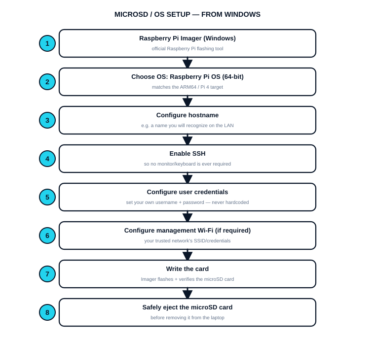

1. Raspberry Pi Imager (Windows) — official Raspberry Pi flashing tool
2. Choose OS: Raspberry Pi OS (64-bit) — matches the ARM64 / Pi 4 target
3. Configure hostname
4. Enable SSH — so no monitor/keyboard is ever required
5. Configure user credentials — set your own username + password, never hardcoded
6. Configure management Wi-Fi (if required)
7. Write the card
8. Safely eject the microSD card

**No hardcoded credentials** — this manual never supplies a default username/password.

---

## First Headless Boot & Verify Management Wi-Fi

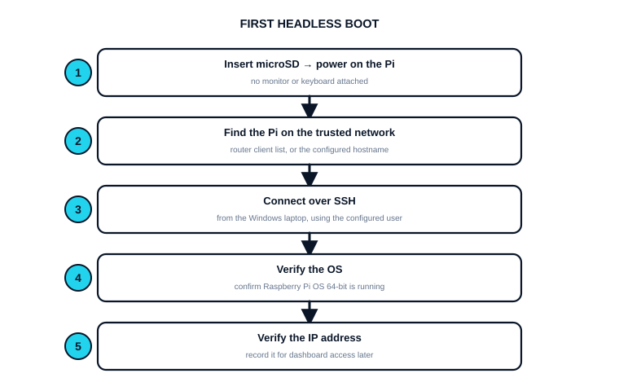

```
ssh <your-username>@<hostname-or-ip>.local
```

Before connecting the monitoring adapter, confirm the built-in Wi-Fi is up and record its actual
interface name — do not assume it will be `wlan0`:

```
ip addr   # confirm an IPv4 address on the built-in Wi-Fi interface
ip link   # confirm the interface is UP
iw dev    # confirm the interface is operating in managed mode
```

**Expected result:** a working SSH session, a built-in Wi-Fi interface with an IP address on
your trusted network, and a noted interface name.

---

## Connect the Single USB Wi-Fi Adapter

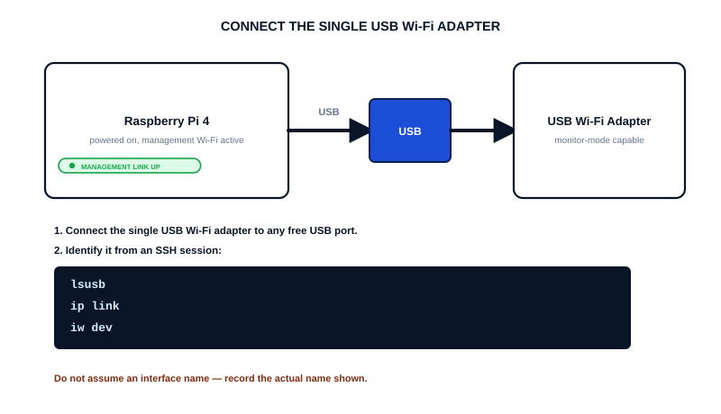

- Connect only the single approved external USB Wi-Fi adapter — never a second one.
- Identify it with `lsusb`, `ip link`, `iw dev`; record its actual interface name.
- Confirm the built-in Wi-Fi management link is still connected and unaffected.
- Consider physically labelling the adapter to avoid confusing it with the built-in interface.

---

## Check Monitor-Mode Support

```
iw list    # look for "monitor" under Supported interface modes
iw dev     # confirm the adapter's interface is listed
```

Checklist — **completed on this deployment** (HARDWARE CAPABILITY VERIFIED):
- [x] USB adapter detected (`lsusb`) — Qualcomm Atheros AR9271
- [x] Chipset identified — AR9271
- [x] Linux driver loaded and working — `ath9k_htc`, firmware 1.3
- [x] "monitor" mode listed as a supported interface type
- [x] Management Wi-Fi still connected throughout (built-in interface unaffected)

Monitor mode was successfully enabled on the external adapter, and a capture was taken with
`tcpdump` containing IEEE 802.11 + Radiotap frames, writing a 100-packet PCAP file.

**What this does and does not establish.** It establishes that this adapter and driver can place
the interface in monitor mode and produce a valid 802.11/Radiotap capture on this Pi. It does
**not** establish that CIPHER ingests such a capture — see the next page. Monitor-mode handling
inside CIPHER remains **SOFTWARE IMPLEMENTATION PENDING**.

If you are repeating this on different hardware and monitor mode is not listed: do not invent
chipset-specific configuration. Record the exact chipset/driver and treat monitor-mode capture as
pending.

Monitor mode is passive reception only. Being in monitor mode does **not** mean the Pi
automatically sees every device's usable traffic on an arbitrary Wi-Fi network: it receives frames
on the channel it is tuned to, within radio range, and frames belonging to a protected network
remain encrypted. CIPHER performs no packet injection, no deauthentication, and no credential
capture, and nothing in this manual should be read as enabling any of those.

---

## Monitor-Mode Capture vs CIPHER Ingestion

These are two different milestones, and only the first is done. Conflating them is the single
easiest way to overstate this project's status.

| Milestone | Status |
|---|---|
| **Monitor-mode hardware capture verified** — AR9271 on `ath9k_htc` placed in monitor mode; 802.11 + Radiotap frames captured with `tcpdump`; 100-packet PCAP written | **Done** (hardware capability verified) |
| **CIPHER end-to-end monitor-mode ingestion validated** — CIPHER consuming raw 802.11/Radiotap traffic and producing assessments from it | **Not done** |

**Why a successful `tcpdump` capture is not CIPHER validation.** `capture/offline_source.py`
yields a packet to the pipeline only when it has an IP layer, a TCP or UDP layer, **and** a
non-empty transport payload; anything else is silently skipped. A monitor-mode capture consists of
802.11 frames wrapped in Radiotap headers, and on a protected (WPA2) network the data frames'
contents are encrypted, so no IP layer is exposed.

Measured against the real, unmodified reader:

| PCAP contents | RawPackets CIPHER yields |
|---|---|
| Encrypted (CCMP) 802.11 data frames | 0 of 5 |
| 802.11 management frames (beacons) | 0 of 5 |
| Mixed encrypted data + management frames | 0 of 4 |
| **Unencrypted** 802.11 data frames carrying IP/TCP via LLC/SNAP | 3 of 3 |

So the existing reader can process a monitor-mode PCAP **only** to the extent that it contains
unencrypted 802.11 data frames whose IP/TCP or IP/UDP payload is non-empty. A capture from a
normal protected Wi-Fi network yields nothing, with no error — the frames are simply skipped.

**Practical consequence.** A PCAP captured on the Pi can be fed to the existing offline mode
today, and it will work for the unencrypted-IP subset described above. Claiming more than that —
in particular claiming that monitor-mode traffic flows end to end through CIPHER — is not
supported, and a dedicated Radiotap/802.11 capture source would be required first.

---

## Clone CIPHER onto the Pi

```
git clone https://github.com/chandini-narayana/cipher-pqc.git
cd cipher-pqc
```

Authenticate securely (SSH key or credential manager/PAT entered interactively). Never paste a
token, password, or private key into a script, commit, or this manual.

---

## Create a New Pi Virtual Environment

> **Do not copy** `venv/` or `.venv-pi-validation/` from the Windows development machine — both
> are Windows/x86-specific and gitignored.

```
python3 -m venv .venv
source .venv/bin/activate
python -m pip install --upgrade pip
pip install -r requirements.txt
```

Every subsequent command in this manual assumes this `.venv` is activated.

---

## Verify ARM64 Software Compatibility

Windows validation does not prove Raspberry Pi compatibility. These pinned dependencies were
installed on the actual Pi (ARM64 Debian 13) and the environment came up successfully:

| Package | Pinned version | ARM64 install result |
|---|---|---|
| flask | 3.1.3 | Installed |
| scapy | 2.7.0 | Installed |
| scikit-learn | 1.8.0 | Installed |
| joblib | 1.5.3 | Installed |
| dilithium-py | 1.4.0 | Installed |
| cryptography | 50.0.0 | Installed |
| reportlab | 5.0.0 | Installed |
| python-dotenv | 1.2.2 | Installed |
| pytest | 9.1.1 | Installed |
| numpy | 2.4.6 | Installed |

Recorded as a whole-environment result: `pip install -r requirements.txt` completed and every
required import succeeded on the Pi. Per-package wheel-versus-build detail was not recorded
individually, so treat the column above as "the environment installed and imported cleanly"
rather than as a per-package wheel-availability audit.

If a package fails on a future rebuild: record the actual failure before proposing any version
change. Do not change a pinned version simply because installation is inconvenient.

---

## Software Validation Before GPIO

```
pytest -q               # full test suite
python preflight.py     # environment/asset readiness check
python evaluate_demo.py # controlled 5-scenario evaluation harness
```

**Results recorded on the Pi so far:**

- Pi full test result: **649/649 passing** — at the pre-reviewer-evaluation baseline
- Pi preflight: **passed**, after training the Isolation Forest locally (`python -m ml.train`)
- Pi required imports: **succeeded**

**Still outstanding on the Pi:**

- The current **1192-test** baseline has not been pulled and re-verified on the Pi
- Pi core scenarios (5/5): ______
- Pi startup time: ______
- Pi CPU utilisation: ______
- Pi memory usage: ______
- Pi temperature: ______

**Do not reuse Windows figures.** The repository's measured performance figures (see the README's
performance section and `data/evaluation/research/latest_performance.json`) are Windows-only. The
Pi equivalents must be measured on the Pi with the same harness:

```
python evaluate_performance.py                          # full benchmark
python evaluate_performance.py --stability-iterations 500   # sustained-run drift check
```

That harness runs unchanged on ARM64 and records platform metadata in its JSON output, so Windows
and Pi results stay distinguishable. **No Pi performance numbers have been collected yet** — do
not quote any.

---

## Isolation Forest ML Model on the Pi

Isolation Forest anomaly detection is optional and secondary to QRS. If no trained model is
present at `ml/artifacts/anomaly_detector.joblib`, CIPHER runs correctly in **QRS-only mode**.

```
python -m ml.train   # regenerates ml/artifacts/anomaly_detector.joblib
```

- Uses the existing, repository-approved synthetic training process (`ml/dataset.py`).
- Do not substitute `data/datasets/CIPHER_Raw_Dataset_InputOnly_5000.xlsx` as training data.
- Prefer regenerating the deterministic model on the Pi using `python -m ml.train` so it is
  created under the Pi's installed Python/scikit-learn environment. If an existing artifact is
  reused instead, its compatibility must be explicitly verified.

---

## Dashboard Access from the Windows Laptop

CIPHER serves its dashboard and REST API from a single Flask process (`run_demo.py`), defaulting
to `127.0.0.1` (Pi-local only).

```
export FLASK_HOST=0.0.0.0
python run_demo.py
```

Then from the Windows laptop's browser:

```
http://<PI-IP>:5000
```

Only bind as widely as needed — `FLASK_HOST=0.0.0.0` exposes the dashboard to the whole trusted
LAN, not just your laptop. Do not expose it more broadly.

---

## GPIO Assignment — Pending Final Approval

> **No GPIO pin is approved yet.** Nothing in the CIPHER repository assigns a physical or BCM
> pin number to the OLED (VCC/GND/SDA/SCL) or to any LED.

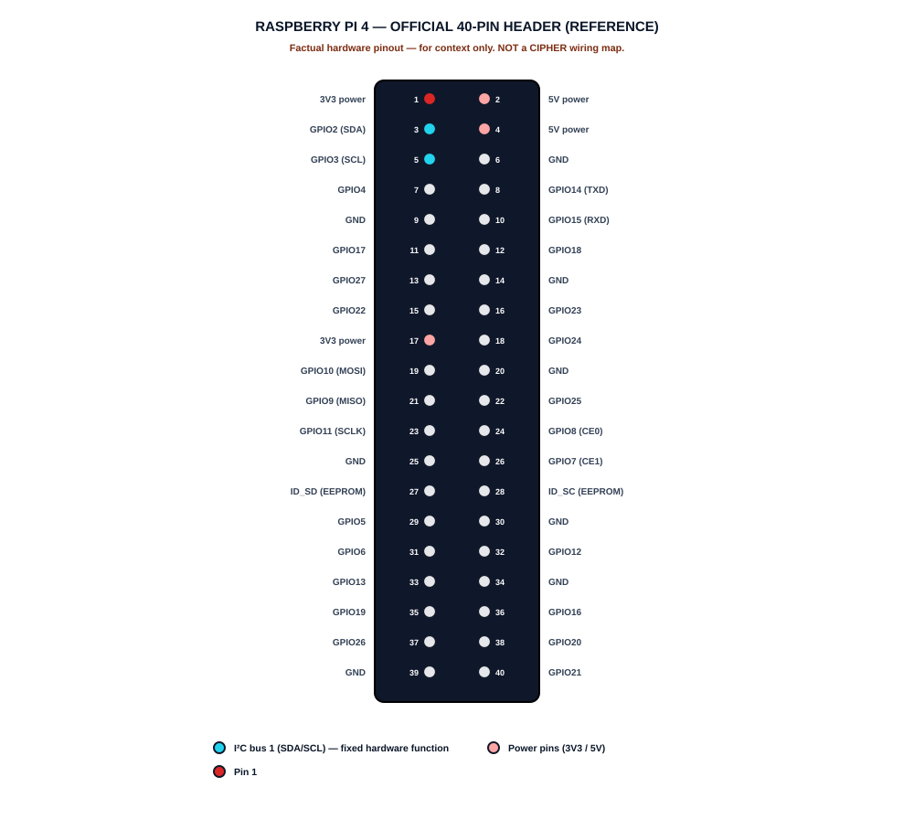

- CIPHER should use the Raspberry Pi's standard I²C1 interface. Its default SDA/SCL connections
  are BCM GPIO2 / physical pin 3 and BCM GPIO3 / physical pin 5.
- Which GND and 3V3/5V pins power the OLED, and which GPIO pins drive the three LEDs, remain
  open decisions.
- Do not wire the OLED or LEDs until a future manual revision freezes these choices.

---

## OLED Hardware — Identification & Pin Map Pending

The approved bill of materials specifies an SSD1306 I²C OLED, typically labelled VCC, GND, SDA,
SCL — always verify the exact markings on your specific module.

**CIPHER OLED wiring: PIN MAP PENDING.** No final GND/power/SDA/SCL pin choice is approved yet.

What the eventual wiring will require:
- A ground connection (any Pi GND pin)
- A power connection matching the module's rated voltage
- CIPHER should use the Raspberry Pi's standard I²C1 interface. Its default SDA/SCL connections
  are BCM GPIO2 / physical pin 3 and BCM GPIO3 / physical pin 5.

---

## LED Hardware — Polarity, Resistors & Intended Behaviour

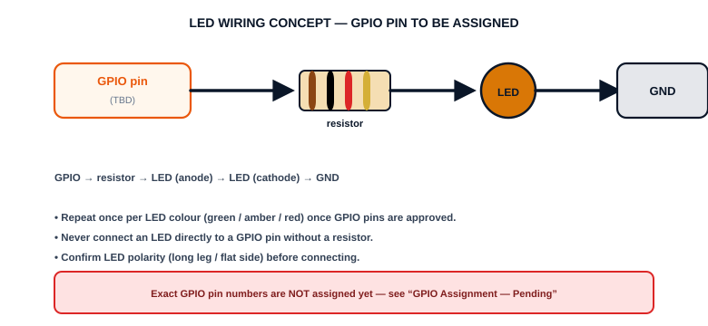

Desired hardware behaviour (software not yet implemented):

| CIPHER risk category | Desired LED colour | Status |
|---|---|---|
| LOW | Green | Software Pending |
| MEDIUM | Amber | Software Pending |
| HIGH | Red | Software Pending |

No GPIO control code exists yet anywhere in the repository. LEDs do not currently respond to any
assessment — this table records intended mapping for a future software phase only.

---

## Complete GPIO Assembly — Pending

A final illustration and wiring table (Component / Signal / BCM / Physical pin / Destination)
can only be produced once the GPIO assignment above is genuinely frozen and approved.

| Component | Signal | BCM | Physical pin | Destination |
|---|---|---|---|---|
| SSD1306 OLED | SDA | GPIO2 | 3 | ______ |
| SSD1306 OLED | SCL | GPIO3 | 5 | ______ |
| SSD1306 OLED | VCC | ______ | ______ | ______ |
| SSD1306 OLED | GND | ______ | ______ | ______ |
| Green LED (LOW) | anode via resistor | ______ | ______ | ______ |
| Amber LED (MEDIUM) | anode via resistor | ______ | ______ | ______ |
| Red LED (HIGH) | anode via resistor | ______ | ______ | ______ |

Never leave an ambiguous connection — every blank cell must be filled from an actually-approved
decision before any wire is connected.

---

## Live Multi-Device Capture — Intended Architecture (Pending)

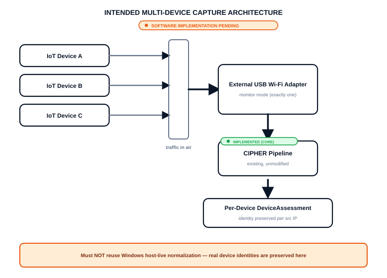

**Do not reuse the Windows host-live approach.** The temporary Windows live-capture mode
(`capture/host_live_source.py`) treats the laptop itself as the one monitored device and
normalizes every packet around its own IP. That behaviour must not be copied into the Pi's
multi-device monitoring architecture, which must preserve each observed device's real identity
by source IP.

---

## Reporting, Signing & Enforcement Logic

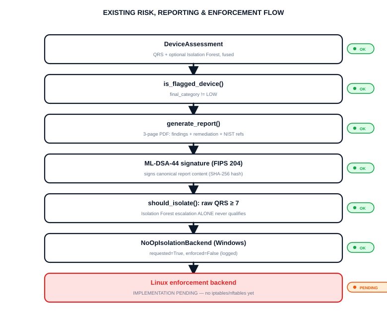

| QRS score | Category | Isolation eligible? |
|---|---|---|
| 0–2 | LOW | No |
| 3–6 | MEDIUM | No |
| 7–10 | HIGH | Yes (raw QRS ≥ 7) |

DeviceAssessment → `is_flagged_device()` (final_category != LOW) → `generate_report()` (3-page
PDF) → ML-DSA-44 signature (FIPS 204) → `should_isolate()` (raw QRS ≥ 7; Isolation Forest
escalation alone never qualifies) → `NoOpIsolationBackend` (Windows: requested=True,
enforced=False) → Linux enforcement backend: **IMPLEMENTATION PENDING — do not apply
iptables/nftables rules yet.**

---

## OLED/LED Software Tests & systemd Boot Concept (Pending)

No OLED or LED driver code exists yet, so no repository-supported test command exists either.

- [ ] OLED initializes and displays expected content over I²C — Pending
- [ ] Green LED lights for LOW — Pending
- [ ] Amber LED lights for MEDIUM — Pending
- [ ] Red LED lights for HIGH — Pending

**systemd boot concept (conceptual only, no `.service` file exists):**
Pi boots → network becomes ready → CIPHER starts → health check passes → dashboard becomes
available. This manual does not invent unit file contents, restart policies, or dependency
ordering — those decisions have not been made in the repository yet.

---

## Final Physical Assembly

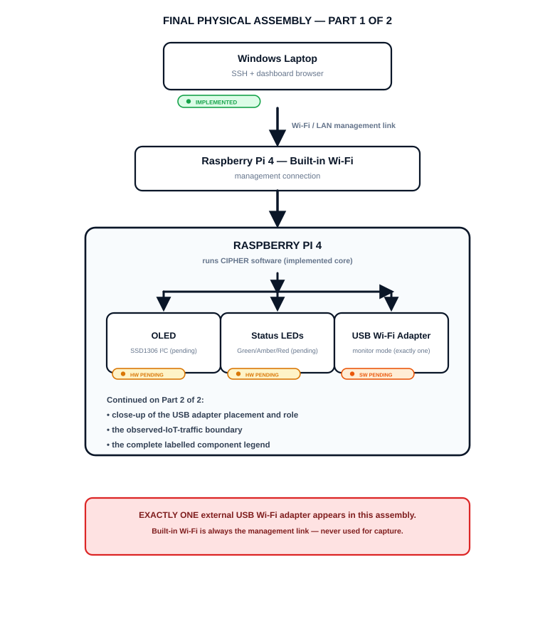
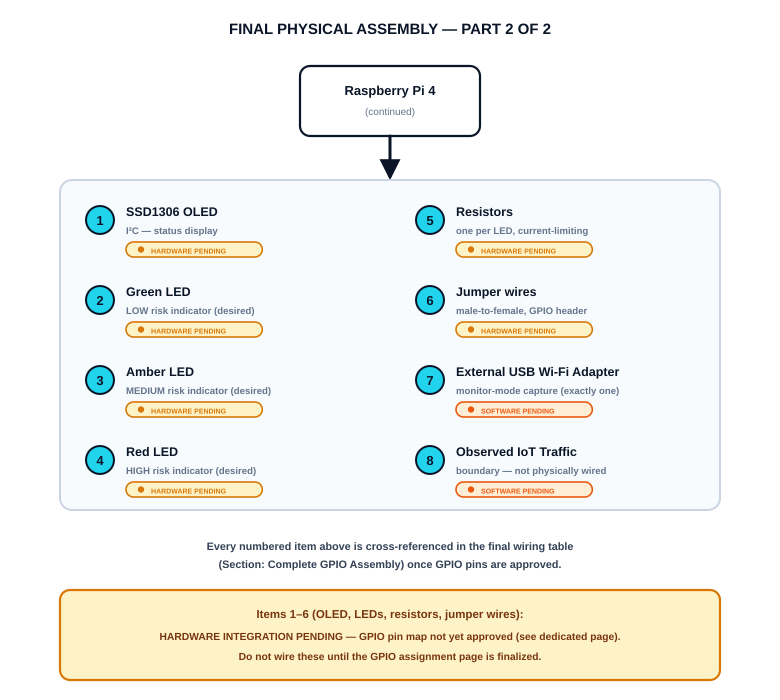

Windows laptop → (Wi-Fi/LAN management) → Raspberry Pi built-in Wi-Fi → Raspberry Pi 4, fanning
out to: OLED (hardware pending), Status LEDs (hardware pending), External USB Wi-Fi adapter
(software pending — **exactly one**).

---

## Power-On Checklist

**Before power**
- [ ] microSD inserted
- [ ] GPIO wiring visually checked (if present)
- [ ] No 3.3V/5V mix-up
- [ ] LED resistors installed (if wired)
- [ ] LED polarity checked (if wired)
- [ ] OLED wiring checked (if wired)
- [ ] Exactly ONE USB Wi-Fi adapter connected
- [ ] No loose conductive parts

**After power**
- [ ] Pi boots
- [ ] Built-in Wi-Fi connects
- [ ] SSH works
- [ ] USB monitoring adapter detected
- [ ] CIPHER `.venv` activates
- [ ] Dependencies load
- [ ] `pytest -q` passes
- [ ] `preflight.py` passes
- [ ] `evaluate_demo.py` passes
- [ ] Dashboard reachable from Windows laptop
- [ ] OLED/LED/capture tests pass — once implemented

---

## Troubleshooting

| Symptom | Check | Likely cause | Safe next action |
|---|---|---|---|
| Pi does not boot | power LED, microSD seated | corrupt image, bad card, insufficient power | re-flash microSD |
| Power warning shown | supply rated wattage | under-rated/damaged supply | use official Pi 4 supply |
| SSH unavailable | SSH enabled at imaging, hostname/IP | SSH not enabled, wrong address | re-check router client list; re-image |
| Built-in Wi-Fi unavailable | `ip link`, `iw dev` | wrong SSID/credentials | re-run Imager Wi-Fi config |
| USB Wi-Fi adapter not detected | `lsusb`, port seating | unsupported chipset, faulty port | try another port; confirm model |
| Monitor mode unsupported | `iw list` | chipset/driver limitation | record chipset; treat as pending |
| Driver missing | `dmesg` | out-of-tree driver absent | confirm Linux driver support first |
| OLED not detected | I²C enabled, wiring vs approved map | I²C disabled or unapproved wiring | confirm GPIO page finalized first |
| OLED blank | power/GND, orientation | loose connection, wrong address | re-check frozen wiring table |
| LED not lighting/wrong colour | polarity, resistor, pin | reversed polarity, wrong pin | verify against frozen table |
| Python dependency failure | fresh `.venv`, pins | reused Windows venv | recreate `.venv` |
| ML model unavailable | `ml/artifacts/anomaly_detector.joblib` | not trained yet | not a blocker; retrain if needed |
| Capture permission error | Linux capture privileges | capture not implemented yet | treat as pending; no broad root access |
| Dashboard inaccessible | `FLASK_HOST`, Pi IP, same LAN | still bound to 127.0.0.1 | set `FLASK_HOST=0.0.0.0` |
| Report generation failure | signing keys, disk space | incomplete ML-DSA-44 keypair | restore/regenerate key files |
| Firewall/enforcement issue | current backend | Linux enforcement not implemented | confirm NoOp backend; no manual rules |

---

## Presentation / Demonstration Mode

1. Pi boots
2. SSH / management connection verified
3. CIPHER preflight (`preflight.py`)
4. Dashboard opened on the laptop
5. Controlled PCAP demo (`run_demo.py` fixture)
6. Live Pi capture — only if implemented and stable
7. OLED / LEDs — only if implemented
8. Generated, signed PDF report
9. Enforcement decision demo, per the current safe implementation

The controlled demo remains the reliable fallback throughout.

---

## Completed Raspberry Pi Bring-Up — Record

Everything in this list has actually been done on the Pi. It is recorded here so that later
revisions do not repeat it, and so that the remaining gaps are unambiguous.

| Step | Result |
|---|---|
| Hardware platform | Raspberry Pi 4 Model B, 4 GB |
| Operating system | ARM64 Debian 13 (Raspberry Pi environment) |
| Built-in Wi-Fi (observed as `wlan0`) | Up, managed mode, used for management/SSH |
| External AR9271 adapter (observed as `wlan1`) | Detected; `ath9k_htc` loaded, firmware 1.3 |
| Monitor mode on the external adapter | Enabled successfully |
| Monitor-mode capture | `tcpdump` captured IEEE 802.11 + Radiotap frames; 100-packet PCAP written |
| Repository | Cloned onto the Pi |
| Python environment | `.venv` created; pinned dependencies installed |
| Required imports | Succeeded |
| Isolation Forest artifact | Trained locally on the Pi via `python -m ml.train` |
| `preflight.py` | Passed |
| Test suite | 649/649 passing, at the pre-reviewer-evaluation baseline |

**Explicitly still outstanding:**

- The current **1192-test** baseline has not been pulled and re-verified on the Pi
- No Pi performance benchmark has been run; no Pi performance figures exist
- CIPHER does not ingest 802.11/Radiotap monitor-mode traffic (no such capture source exists)
- No physical network isolation has been demonstrated, and isolation latency is unmeasured
- No OLED or GPIO LED driver code exists in tracked source
- Sustained long-duration operation has not been validated

---

## Hardware & Software Status Table

| Capability | Current Status | Verified on Pi? |
|---|---|---|
| Core CIPHER pipeline | Implemented | Yes — at the 649-test baseline |
| QRS | Implemented | Yes — at the 649-test baseline |
| Isolation Forest (optional) | Implemented | Yes — artifact trained on the Pi; preflight passed |
| Signed PDF report generation | Implemented | Covered by the Pi test run; not separately demonstrated |
| ML-DSA-44 signing | Implemented | Covered by the Pi test run |
| REST API + dashboard | Implemented | Not yet confirmed from the laptop browser |
| Built-in management Wi-Fi | OS-level, implemented | Yes — SSH and management worked throughout |
| Current 1192-test baseline | Implemented (Windows) | **No — not yet pulled or re-verified on the Pi** |
| USB monitor adapter — **hardware** | Hardware capability verified | Yes — monitor mode + `tcpdump` PCAP |
| USB monitor adapter — **CIPHER ingestion** | Software pending | No — no Radiotap/802.11 capture source exists |
| Multi-device live capture | Software pending | No |
| Pi performance benchmark | Harness implemented | **No — pending execution** |
| OLED | Hardware integration pending | No — no driver code |
| Status LEDs | Hardware integration pending | No — no driver code |
| Linux enforcement (firewall isolation) | Software pending | No — `NoOpIsolationBackend` only |
| Physical isolation latency | Not measured | No |
| systemd service | Software pending | No |
| Sustained (72-hour) operation | Not yet validated | No |

Populate or revise this column only from actual repository inspection and real tests run on real
Pi hardware — never from assumption or from Windows results.
